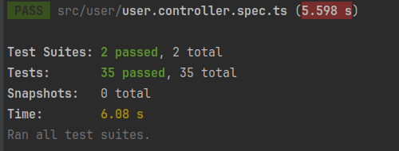

<p align="center">  
  <a href="http://nestjs.com/" target="blank"></a>  
</p>  

[circleci-image]: https://img.shields.io/circleci/build/github/nestjs/nest/master?token=abc123def456
[circleci-url]: https://circleci.com/gh/nestjs/nest
»
  <p align="center">A progressive <a href="http://nodejs.org" target="_blank">Node.js</a> framework for building efficient and scalable server-side applications.</p>  
    <p align="center">  
<a href="https://www.npmjs.com/~nestjscore" target="_blank"></a>  
<a href="https://www.npmjs.com/~nestjscore" target="_blank"></a>  
<a href="https://www.npmjs.com/~nestjscore" target="_blank"></a>  
<a href="https://circleci.com/gh/nestjs/nest" target="_blank"></a>  
<a href="https://coveralls.io/github/nestjs/nest?branch=master" target="_blank"></a>  
<a href="https://discord.gg/G7Qnnhy" target="_blank"></a>  
<a href="https://opencollective.com/nest#backer" target="_blank"></a>  
<a href="https://opencollective.com/nest#sponsor" target="_blank"></a>  
  <a href="https://paypal.me/kamilmysliwiec" target="_blank"></a>  
    <a href="https://opencollective.com/nest#sponsor"  target="_blank"></a>  
  <a href="https://twitter.com/nestframework" target="_blank"></a>  
</p>  
  <!--[](https://opencollective.com/nest#backer)  
  [](https://opencollective.com/nest#sponsor)-->  

## User Wallet Management Microservice

### Overview
This project is a microservice designed to manage user wallet data, built using the Nest.js framework and TypeScript. It provides APIs to interact with other microservices, handling user balances and transactions. The project is containerized with Docker and uses PostgreSQL for data persistence.

#### Features
- **Get User Balance**: Retrieve the current balance of a user.
- **Manage User Wallet**: Add or subtract money from a user's wallet, ensuring balance integrity.
- **CRUD Operations**: Create, read, update, and delete user information.
- **Transaction Logging**: Log all transactions for auditing purposes.
- **Daily Totals**: Calculate and log the total amount of transactions processed each day.

##
#### API Endpoints

##### 1. Get User Balance

-   **URL**: `/api/user/:user_id/balance`
-   **Method**: GET
-   **Description**: Retrieves the current balance of a user.
-   **Input**: `user_id` (integer)
-   **Output**: JSON object containing the balance, e.g., `{"balance": 4000}`

##### 2. Manage User Wallet

-   **URL**: `/api/user/money`
-   **Method**: POST
-   **Description**: Adds or subtracts money from a user's wallet.
-   **Input**: JSON payload with `user_id` (integer) and `amount` (integer; negative for deductions)
-   **Output**: JSON object with the transaction reference ID, e.g., `{"reference_id": 123123123}`

###
#### Additional Endpoints

-   **Create User**: `POST /user`
-   **Find All Users**: `GET /user`
-   **Find One User**: `GET /user/:id`
-   **Update User**: `PATCH /user/:id`
-   **Delete User**: `DELETE /user/:id`

## Requirements

- Node.js (version 20  or higher)
- PostgreSQL
- Docker (optional)


#
#### Setup and Installation

1.  **Clone the repository** :  
   ```
      git clone https://github.com/javadib/daal-wallet.git 
      cd daal-wallet
   ```


###
2. **Install dependencies** :
   ```npm install```

####
3.  **Environment Variables**: Create a `.env` file in the root directory and add the following environment variables:

    ```
    P_DB_HOST=127.0.0.1
    P_DB_PORT=5432
    P_DB_USERNAME=postgres
    P_DB_PASSWORD=postgres
    P_DB_NAME=daalW
    ```

###
4.  **Run the application**:
    `npm run start`

### Run in Docker: 
Ensure Docker is installed and running. Build and start the container:    
    `docker-compose up --build`

###
#### Assumptions
-   User balance should never be negative.
-   All transactions are logged for auditing purposes.
-   Daily totals are calculated and logged at the end of each day.

## Testing
Run unit tests:
`npm run test`

###



##
Thank you for using our User Wallet Management